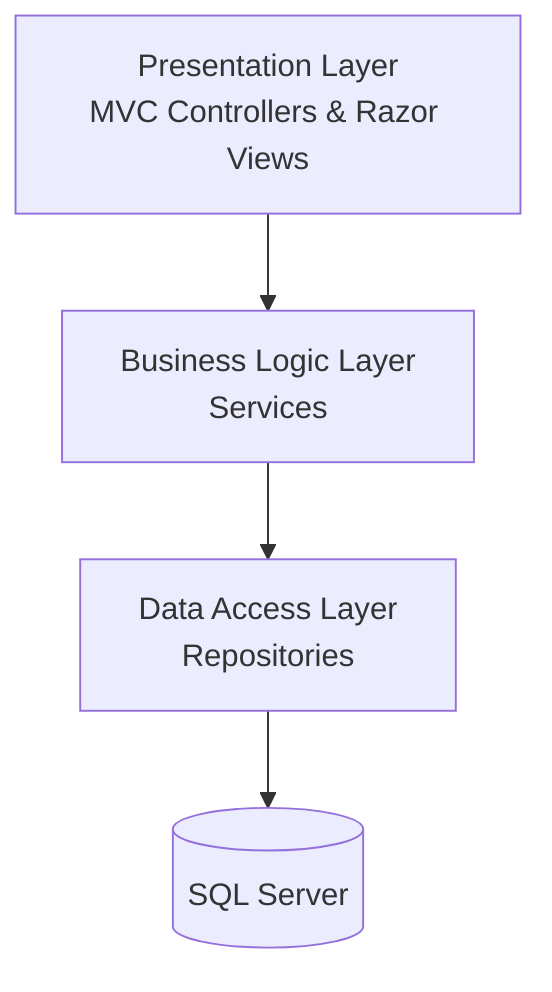
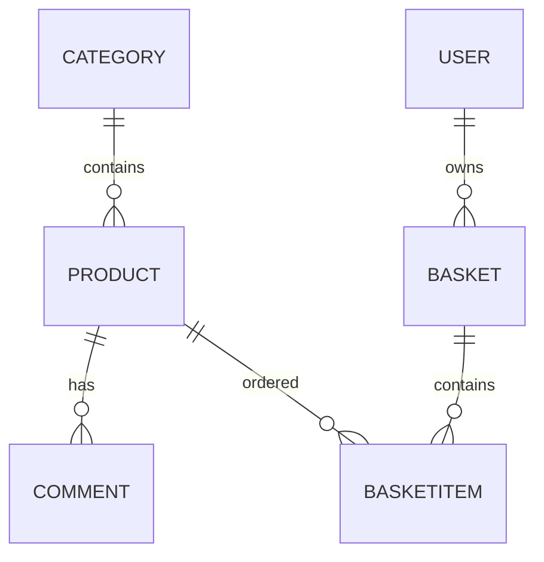

<div align="center">

# 🛒 Ghafar Tajhiz

### A Modern Multi-Layer E-Commerce Platform Built with ASP.NET Core MVC


*A multi-layer e-commerce platform consisting of two web applications: a Customer Store and an Admin Dashboard.*

</div>

---

# 📑 Table of Contents

- Overview
- Applications
- Architecture
- Features
- Solution Structure
- Database Design
- Technology Stack
- Screenshots

---

# 📖 Overview

**Ghafar Tajhiz** is a modern multi-layer e-commerce platform built with **ASP.NET Core MVC (.NET 8)**, **Entity Framework Core**, and **SQL Server**.

The solution contains two independent web applications that share the same Business Logic and Data Access layers.

The project was developed to simulate a real-world online shopping platform while applying software engineering principles such as layered architecture, dependency injection, repository pattern, asynchronous programming, and clean separation of concerns.

---

# 🖥 Applications

## 🛍 Customer Website

- User Registration & Login
- Browse Products
- Product Details
- Product Search & Sorting
- Pagination
- Shopping Cart
- Checkout
- Order History
- Product Comments
- Profile Management

---

## ⚙️ Admin Dashboard

- Product Management (CRUD)
- Category Management (CRUD)
- Product Image Upload/Delete
- Order Management
- Order Approval & Cancellation
- Order Search & Sorting

---

# 🏗 Architecture



---

# ✨ Features

## Architecture & Backend

- Layered Architecture
- Repository Pattern
- Service Layer
- Dependency Injection
- Entity Framework Core
- ASP.NET Identity
- Cookie Authentication
- DTO Pattern
- Async Programming
- LINQ

---

## Frontend

- Razor Views
- Partial Views
- HTML5
- CSS3
- JavaScript
- AJAX Requests

---

## Business Features

- Authentication
- Product Catalog
- Shopping Cart
- Checkout
- Customer Profile
- Order Management
- Product Comments
- File Upload
- Pagination
- Product Search & Sorting
- Data Validation

---

# 📁 Solution Structure

```text
Ghafar-Tajhiz

├── BusinessLogic
│   ├── BasketServices
│   ├── BasketItemServices
│   ├── CategoryServices
│   ├── CommentServices
│   ├── ProductServices
│   ├── ProfileServices
│   └── FileUpload
│
├── DataAccess
│   ├── Data
│   ├── Models
│   ├── Repositories
│   ├── Enums
│   └── Migrations
│
├── Ghafar-Tajhiz
│   ├── Controllers
│   ├── Views
│   └── wwwroot
│
└── Ghafar-Tajhiz-Admin
    ├── Controllers
    ├── Views
    └── wwwroot
```

---

# 🗄 Database Design

### Main Entities

- User
- Role
- Category
- Product
- Basket
- BasketItem
- Comment



### Database Features

- Entity Framework Core Code First
- Foreign Key Constraints
- Composite Unique Index
- Cascade Delete
- Restrict Delete
- DataAnnotations Validation

---

# 🛠 Technology Stack

## Backend

- ASP.NET Core MVC (.NET 8)
- Entity Framework Core
- SQL Server
- ASP.NET Identity

## Frontend

- Razor Views
- HTML5
- CSS3
- JavaScript

## Development Tools

- Visual Studio 2022
- Git
- GitHub

---

# 📸 Screenshots


> Product List


---

> Product Details


---

> Shopping Cart


---

> Customer Profile


---

> Login Page


---

> Admin Dashboard


---

> Product Management


---

> Order Management


---


<div align="left">

__Made with __

</div>
