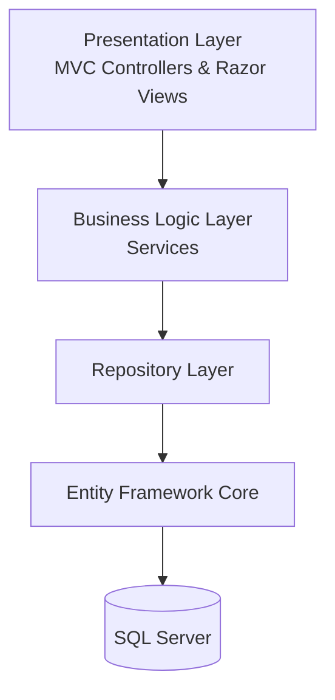
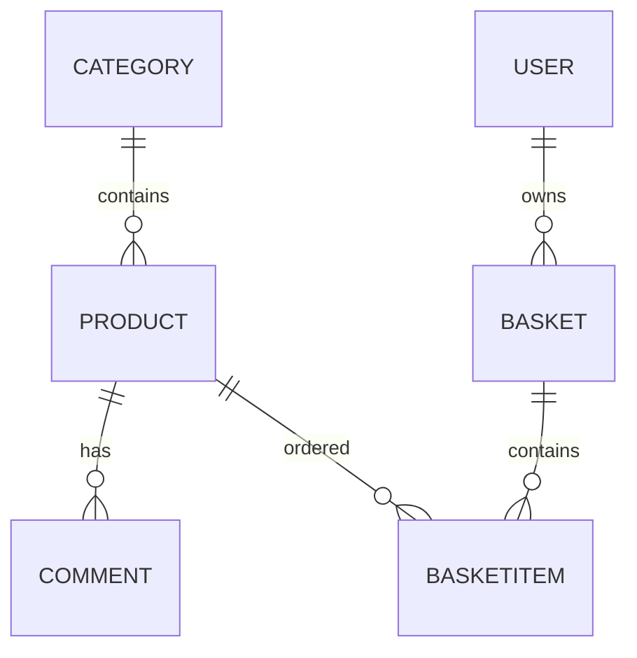

<div align="center">

# 🛒 Ghafar Tajhiz

### A Layered ASP.NET Core MVC E-Commerce Platform

[](https://dotnet.microsoft.com/)
[](https://learn.microsoft.com/aspnet/core)
[](https://learn.microsoft.com/ef/core)
[](https://www.microsoft.com/sql-server)
[](#)

*A multi-layer online shopping platform consisting of two web applications: a Customer Store and an Admin Dashboard.*

</div>

---

# 📑 Table of Contents

- Overview
- Project Highlights
- Features
- Architecture
- Solution Structure
- Database Design
- Technology Stack
- Screenshots

---

# 📖 Overview

**Ghafar Tajhiz** is a multi-layer e-commerce application developed with **ASP.NET Core MVC (.NET 8)** and **Entity Framework Core**.

The solution consists of two separate web applications sharing the same **Business Logic** and **Data Access** layers.

### Customer Website

- Browse products
- Search products
- Sort products
- Pagination
- Product details
- Shopping cart
- Checkout
- Order history
- Product comments
- Authentication
- Customer profile

### Admin Dashboard

- Product management
- Category management
- Product image upload
- Order management
- Approve / Cancel orders
- Search orders
- Sort orders

The project was developed to demonstrate software engineering principles including layered architecture, repository pattern, service layer, dependency injection and maintainable application design.

---

# 🚀 Project Highlights

| Area | Implementation |
|------|----------------|
| Architecture | Layered Architecture |
| Backend | ASP.NET Core MVC (.NET 8) |
| ORM | Entity Framework Core |
| Database | SQL Server |
| Authentication | ASP.NET Identity |
| Data Access | Repository Pattern |
| Business Logic | Service Layer |
| Dependency Injection | Built-in DI |
| Validation | DataAnnotations |
| Programming | Async / Await |
| Querying | LINQ |
| Frontend | Razor Views + HTML + CSS + JavaScript |

---

# ✨ Features

## Customer

- User Registration & Login
- Cookie Authentication
- Product Listing
- Product Details
- Product Search
- Product Sorting
- Pagination
- Shopping Cart
- Add / Remove Basket Items
- Basket Counter
- Checkout
- Customer Profile
- Order History
- Product Comments

---

## Admin

- Product CRUD
- Category CRUD
- Product Image Upload
- Product Image Delete
- Order Management
- Order Approval
- Order Cancellation
- Search Orders
- Sort Orders

---

# 🏗 Architecture

The application follows a layered architecture to keep responsibilities separated.



---

# 📁 Solution Structure

```
Ghafar-Tajhiz

│

├── BusinessLogic
│   ├── BasketServices
│   ├── BasketItemServices
│   ├── CategoryServices
│   ├── CommentServices
│   ├── ProductServices
│   ├── ProfileServices
│   └── FileUpload

│

├── DataAccess
│   ├── Data
│   ├── Models
│   ├── Repositories
│   ├── Enums
│   └── Migrations

│

├── Ghafar-Tajhiz
│   ├── Controllers
│   ├── Views
│   └── wwwroot

│

└── Ghafar-Tajhiz-Admin
    ├── Controllers
    ├── Views
    └── wwwroot
```

---

# 🗄 Database Design

Main entities:

- User
- Role
- Category
- Product
- Basket
- BasketItem
- Comment



Database implementation includes:

- Entity Framework Core Code First
- Composite Unique Index for Basket Items
- Foreign Key Constraints
- Cascade Delete
- Restrict Delete
- DataAnnotations Validation

---

# ⚙ Technical Features

- Repository Pattern
- Service Layer
- Layered Architecture
- Dependency Injection
- Entity Framework Core
- ASP.NET Identity
- Cookie Authentication
- DTOs
- LINQ
- Async / Await
- Razor Views
- AJAX Requests
- Partial Views
- File Upload
- Data Validation
- Pagination
- Search & Sorting

---

# 🛠 Technology Stack

## Backend

- ASP.NET Core MVC (.NET 8)
- Entity Framework Core
- SQL Server
- ASP.NET Identity

## Frontend

- HTML5
- CSS3
- JavaScript
- Razor Views

---

# 📸 Screenshots

Add screenshots inside the **screenshots** folder.

Suggested screenshots:

- Home Page
- Product List
- Product Details
- Shopping Cart
- Login
- Customer Profile
- Admin Dashboard
- Product Management
- Order Management


---

<div align="center"> <sub>Built with ❤️ and a lot of .NET</sub> </div> ```
