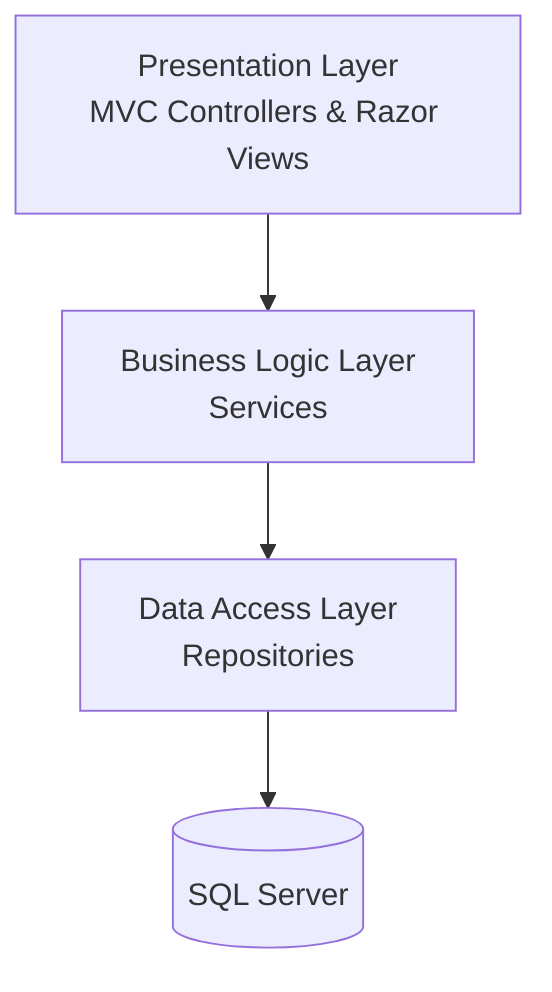
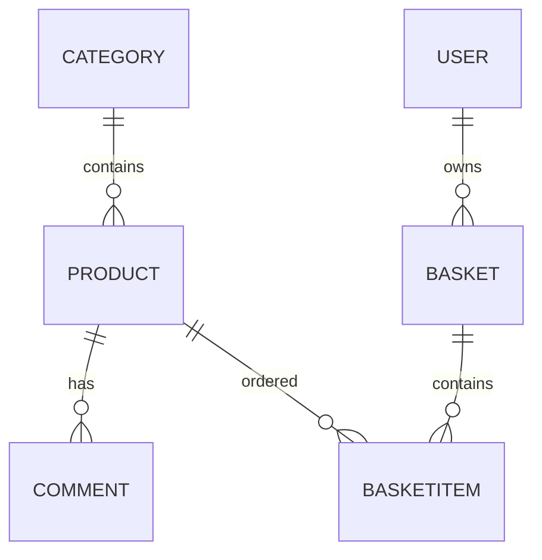

<div align="center">

# 🛒 Ghafar Tajhiz

### A Modern Multi-Layer E-Commerce Platform Built with ASP.NET Core MVC


*A multi-layer online shopping platform consisting of two web applications: a Customer Store and an Admin Dashboard.*

</div>

---

# 📑 Table of Contents

- Overview
- Applications
- Project Highlights
- Features
- Architecture
- Solution Structure
- Database Design
- Technical Features
- Technology Stack
- Screenshots

---

# 📖 Overview

**Ghafar Tajhiz** is a multi-layer e-commerce application built with **ASP.NET Core MVC (.NET 8)**, **Entity Framework Core**, and **SQL Server**.

The solution contains two independent web applications that share the same **Business Logic** and **Data Access** layers.

The project was developed to practice building scalable ASP.NET Core applications while applying software engineering principles such as layered architecture, dependency injection, repository pattern, asynchronous programming, and maintainable application design.

---

# 🖥 Applications

## 🛍 Customer Website

Customers can:

- Register and Login
- Browse Products
- View Product Details
- Search Products
- Sort Products
- Browse with Pagination
- Add Products to Shopping Cart
- Remove Products from Cart
- Checkout Orders
- View Order History
- Submit Product Comments
- Manage Personal Profile

---

## ⚙️ Admin Dashboard

Administrators can:

- Manage Products (CRUD)
- Manage Categories (CRUD)
- Upload Product Images
- Delete Uploaded Images
- Manage Customer Orders
- Approve Orders
- Cancel Orders
- Search Orders
- Sort Orders

---

# 🚀 Project Highlights

| Area | Implementation |
|------|----------------|
| Architecture | Multi-Layer Architecture |
| Backend | ASP.NET Core MVC (.NET 8) |
| ORM | Entity Framework Core |
| Database | SQL Server |
| Authentication | ASP.NET Identity |
| Data Access | Repository Pattern |
| Business Logic | Service Layer |
| Dependency Injection | Built-in Dependency Injection |
| Validation | DataAnnotations |
| Programming | Async / Await |
| Querying | LINQ |
| Frontend | Razor Views, HTML, CSS, JavaScript |

---

# ✨ Features

## Customer Features

- Authentication
- Product Catalog
- Product Details
- Product Search
- Product Sorting
- Pagination
- Shopping Cart
- Basket Counter
- Checkout
- Customer Profile
- Order History
- Product Comments

---

## Admin Features

- Product Management (CRUD)
- Category Management (CRUD)
- Product Image Upload
- Product Image Delete
- Order Management
- Order Approval
- Order Cancellation
- Order Search
- Order Sorting

---

# 🏗 Architecture

The project follows a **Layered Architecture** to keep responsibilities separated.



---

# 📁 Solution Structure

```
Ghafar-Tajhiz

├── BusinessLogic
│   ├── BasketServices
│   ├── BasketItemServices
│   ├── CategoryServices
│   ├── CommentServices
│   ├── ProductServices
│   ├── ProfileServices
│   └── FileUpload
│
├── DataAccess
│   ├── Data
│   ├── Models
│   ├── Repositories
│   ├── Enums
│   └── Migrations
│
├── Ghafar-Tajhiz
│   ├── Controllers
│   ├── Views
│   └── wwwroot
│
└── Ghafar-Tajhiz-Admin
    ├── Controllers
    ├── Views
    └── wwwroot
```

---

# 🗄 Database Design

### Main Entities

- User
- Role
- Category
- Product
- Basket
- BasketItem
- Comment



### Database Features

- Entity Framework Core Code First
- Composite Unique Index for Basket Items
- Foreign Key Constraints
- Cascade Delete
- Restrict Delete
- DataAnnotations Validation

---

# ⚡ Technical Features

- Layered Architecture
- Repository Pattern
- Service Layer
- Dependency Injection
- Entity Framework Core
- ASP.NET Identity
- Cookie Authentication
- DTO Pattern
- LINQ
- Async Programming
- Razor Views
- Partial Views
- AJAX Requests
- File Upload
- Data Validation
- Pagination
- Product Search
- Product Sorting

---

# 🛠 Technology Stack

## Backend

- ASP.NET Core MVC (.NET 8)
- Entity Framework Core
- SQL Server
- ASP.NET Identity

## Frontend

- Razor Views
- HTML5
- CSS3
- JavaScript

## Development Tools

- Visual Studio 2022
- Git
- GitHub

---

# 📸 Screenshots

> Screenshots will be added soon.

Suggested screenshots:

- Home Page
- Product List
- Product Details
- Shopping Cart
- Customer Profile
- Login Page
- Admin Dashboard
- Product Management
- Order Management

---

<div align="left">
    
__Made with __

</div>
